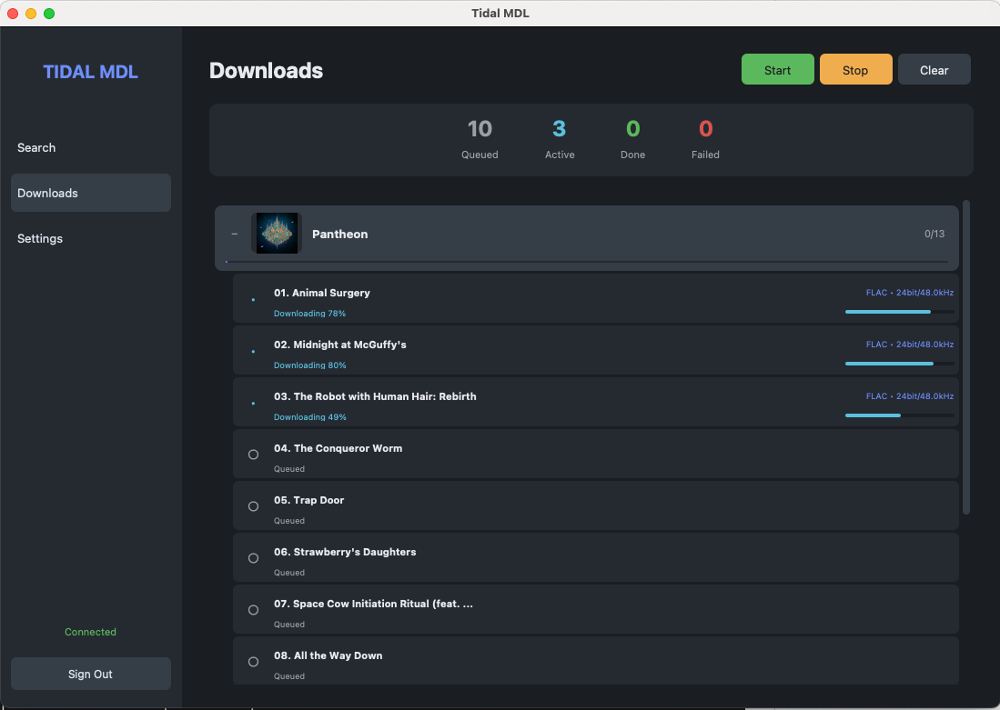

# 🎵 Tidal MDL

A command-line tool to download high-quality music from Tidal.



## Quick Start

### Download Executable (Easiest)

Download from [Releases](../../releases):

| Platform | File |
|----------|------|
| Windows | `tidal-mdl-windows.exe` |
| macOS | `tidal-mdl-macos` |
| Linux | `tidal-mdl-linux` |

### Run from Source

```bash
# Clone and setup
git clone https://github.com/yourusername/tidal-mdl.git
cd tidal-mdl
python3 -m venv venv
source venv/bin/activate  # Windows: venv\Scripts\activate
pip install -r requirements.txt

# Run
python cli.py
```

### Optional: Install FFmpeg

FFmpeg enables native FLAC output for Hi-Res downloads:

```bash
# macOS
brew install ffmpeg

# Ubuntu/Debian  
sudo apt install ffmpeg

# Windows: https://ffmpeg.org/download.html
```

## Usage

```bash
# Interactive mode
python cli.py

# Direct download
python cli.py --download "https://tidal.com/browse/album/12345678"

# Set quality
python cli.py --quality HI_RES
```

### Commands

| Command | Description |
|---------|-------------|
| `search <query>` | Search for music |
| `dl-album <id>` | Download album |
| `dl-track <id>` | Download track |
| `dl-playlist <id>` | Download playlist |
| `queue` | View download queue |
| `help` | Show all commands |

## Configuration

Copy `.env.example` to `.env` and customize:

```ini
DOWNLOAD_QUALITY=HI_RES    # NORMAL, HIGH, LOSSLESS, HI_RES
DOWNLOAD_FOLDER=./downloads
EMBED_ALBUM_ART=true
```

### Quality Options

| Quality | Format |
|---------|--------|
| `HI_RES` | FLAC 24-bit up to 192kHz |
| `LOSSLESS` | FLAC 16-bit 44.1kHz |
| `HIGH` | AAC 320kbps |
| `NORMAL` | AAC 96kbps |

## Build

```bash
# macOS/Linux
./build.sh

# Windows
build.bat
```

## ⚠️ Disclaimer

- **Private use only** - Do not distribute copyrighted content
- **Requires Tidal HiFi subscription**
- **May violate Tidal ToS** - Use at your own risk
- **Educational purposes only**

## Credits

Built with:
- [tidalapi](https://github.com/tamland/python-tidal) - Tidal API
- [Rich](https://github.com/Textualize/rich) - Terminal UI
- [Mutagen](https://github.com/quodlibet/mutagen) - Audio metadata
